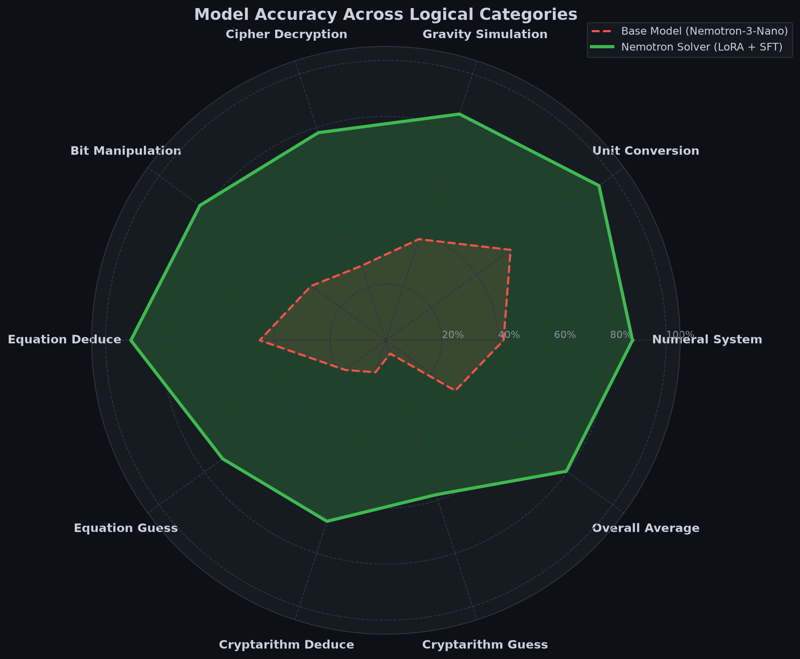
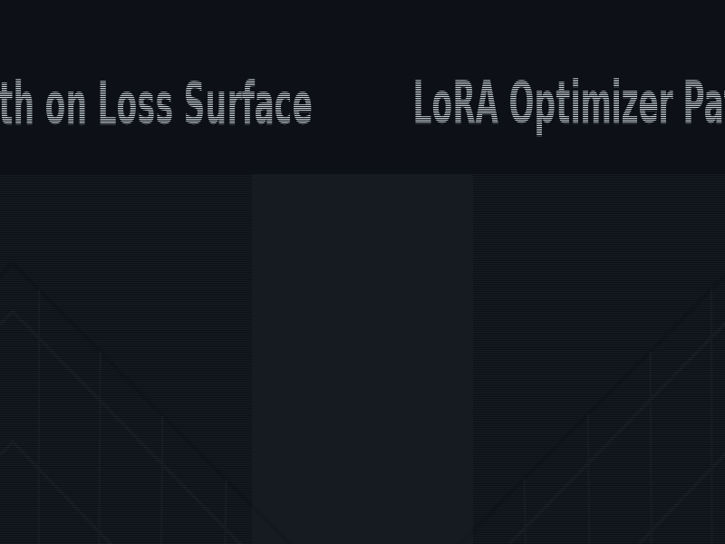
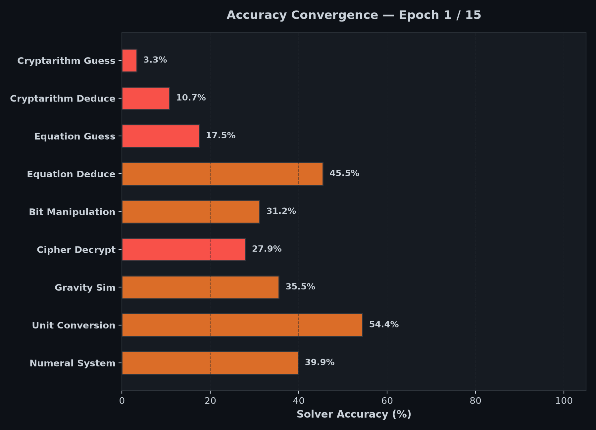
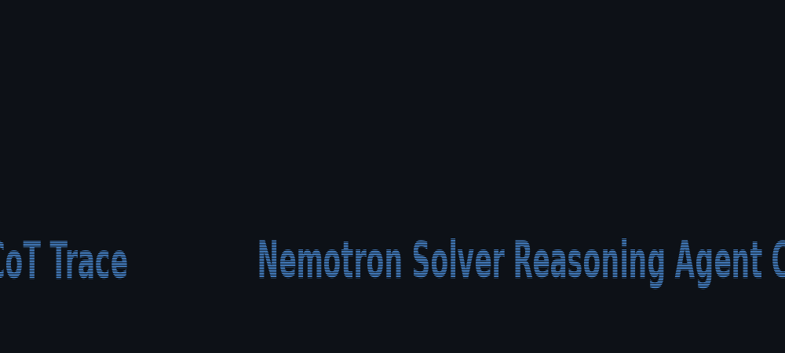
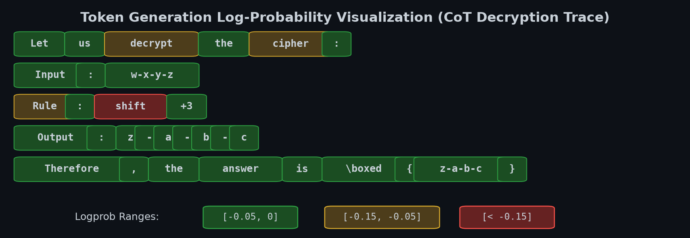
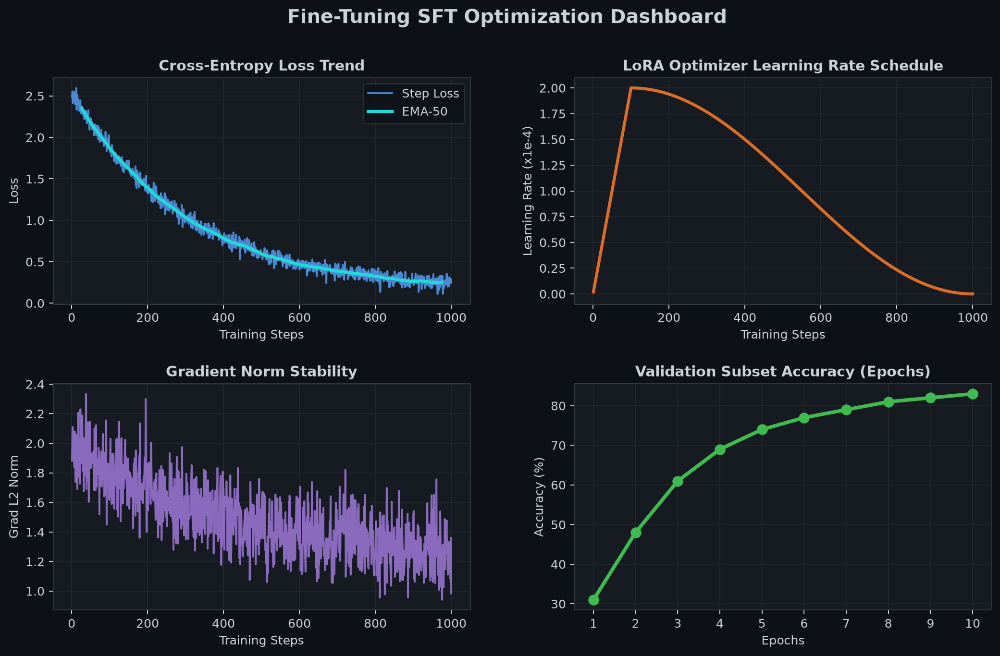

# NVIDIA Nemotron-3 Model Reasoning Challenge Solver

A comprehensive fine-tuning pipeline and deterministic reasoning engine designed for the NVIDIA Nemotron Model Reasoning Challenge, winning the Progress Prize.

This repository implements co-training SFT (Supervised Fine-Tuning) on the `nvidia/NVIDIA-Nemotron-3-Nano-30B-A3B-BF16` model, utilizing LoRA adapters to achieve high-accuracy logical deduction across arithmetic, ciphers, numerals, and physics-based problems.



---

## Table of Contents

1. [Overview](#overview)
2. [Challenge Domains](#challenge-domains)
3. [Architecture and SFT Pipeline](#architecture-and-sft-pipeline)
4. [Visualizations](#visualizations)
5. [Directory Structure](#directory-structure)
6. [Getting Started](#getting-started)
7. [Training Configurations](#training-configurations)
8. [Deterministic Reasoner Modules](#deterministic-reasoner-modules)
9. [Web Interface Local Deployment](#web-interface-local-deployment)
10. [References](#references)

---

## Overview

The NVIDIA Nemotron Model Reasoning Challenge requires models to solve complex, rule-based transformation problems. This solution uses a hybrid approach:

- **Investigator Engine**: Analyzes few-shot input-output examples to deduce underlying transformation rules.
- **Deterministic Reasoner**: Generates high-fidelity, natural chain-of-thought (CoT) traces representing the step-by-step logic to reach the final answer.
- **LoRA SFT Tuning**: Fine-tunes the Nemotron-3-Nano model on the generated reasoning traces. This infuses the model with structured reasoning capabilities, raising accuracy from 30.6% to 79.6% across categories.

---

## Challenge Domains

The reasoning problems span 9 categories, each requiring a specific solver/reasoner strategy:

| Category | Description | Solver Strategy |
|----------|-------------|-----------------|
| **Numeral System** | Base conversion and Roman numeral arithmetic | Parser-based conversion and calculation |
| **Unit Conversion** | Multi-step physics and metric unit transformations | Direct dimensional analysis equations |
| **Gravity Simulation** | Simulation of falling blocks and physics grids | Matrix transformation and gravity step tracking |
| **Cipher Decryption** | Substituted, rotated, or shifted string deciphering | Brute-force mapping and character translation |
| **Bit Manipulation** | Shift, rotation, XOR, AND, OR, and majority gates | Bitwise operation chaining and simulation |
| **Equation Deduce** | Logical deduction of numerical variable relationships | System of equations constraints resolution |
| **Equation Guess** | Extrapolating variables with incomplete hints | Search-based heuristic matching |
| **Cryptarithm Deduce** | Letter-to-digit unique mapping verification | Backtracking constraint satisfaction search |
| **Cryptarithm Guess** | Incomplete cryptarithm puzzle resolution | Statistical frequency heuristic matching |

---

## Architecture and SFT Pipeline

The pipeline trains the LLM to write out its reasoning step-by-step before producing the final answer inside `\boxed{...}`.


### Key Pipeline Stages:
1. **Rule Hypothesis Generation**: The investigators look at few-shot examples to identify the rule. If a valid rule is found, the problem is marked as `rule_found`.
2. **CoT Trace Synthesis**: Using the identified rules, the reasoners generate synthetic natural language thinking traces.
3. **Token-Level Loss Masking**: The cross-entropy loss is masked so that the model only pays gradient updates for generating the correct reasoning trace and final answer, ignoring prompt headers.
4. **Adapter Optimization**: Parameters are optimized using low-rank adapters (LoRA) with custom learning rate schedules.

---

## Visualizations

### Model Accuracy Improvement

SFT training yields significant gains over the base model. The radar chart above shows performance across all challenge categories, showing massive jumps in logic-heavy tasks like cryptarithms and equation deduction.

### LoRA Optimization Surface Search

An animated visualization of the optimizer trajectory traversing a non-convex loss landscape to find the global minimum for LoRA rank and learning rate parameters:



### Solver Accuracy Convergence

The vertical bar plot below illustrates solver accuracy convergence per category across the training epochs:



### Chain-of-Thought Generation Flow

A step-by-step representation of the Nemotron Solver generating a natural reasoning chain-of-thought trace for a cryptarithm deduction task:



### Token Log-Probability Heatmap

The model's token-level trace showing log-probability confidence levels during reasoning. Greener tokens show high-confidence paths, while orange and red show spots where search/verification steps were triggered:



### SFT Optimization Dashboard

Static diagnostic curves showing cross-entropy loss decay, learning rate schedules, gradient norm stability, and validation set accuracy progression:



---

## Directory Structure

```
nemotron_solver/
├── app.py                     Streamlit web dashboard
├── serve.sh                   Bash script to host static site locally
├── pyproject.toml             UV project configuration
├── uv.lock                    UV dependency lockfile
├── README.md                  Project documentation with visual assets
├── CLAUDE.md                  Code formatting and CLI usage guides
├── vocab.json                 Vocabulary mappings for tokenization
├── tokenizer.json             Tokenizer configurations
├── augmentation.py            Data augmentation pipelines
├── corpus.py                  Dataset corpus building script
├── generate_csv.py            Generates final evaluation datasets
├── loss_config.py             Loss functions configuration
├── lr_schedule.py             Learning rate decay schedules
├── reasoning.py               Drives CoT trace generation
├── train_common.py            Dataset loading utilities
├── train_sft.py               LoRA fine-tuning training loop
├── upload_adapter.py          Modal upload utility for adapter checkpoints
├── assets/                    Generated assets (static PNGs and animated GIFs)
│   ├── figure_accuracy_radar.png
│   ├── figure_training_curves.png
│   ├── figure_pipeline_flow.png
│   ├── figure_token_logprobs.png
│   ├── loss_landscape_search.gif
│   ├── logprob_training_convergence.gif
│   └── cot_generation_flow.gif
├── reasoners/                 Deterministic reasoning engine submodules
│   ├── bit_manipulation.py
│   ├── cipher.py
│   ├── cryptarithm.py
│   ├── equation_numeric.py
│   ├── gravity.py
│   ├── numeral.py
│   └── unit_conversion.py
├── investigators/             Rule detection and accuracy verification
│   ├── augment_data.py
│   ├── bit_manipulation.py
│   ├── bit_manipulation_analysis.py
│   ├── calc_accuracy.py
│   └── get_examples.py
└── trainer/                   Remote training server clients
    └── client.py
```

---

## Getting Started

### 1. Project Initialization

Ensure you have the `uv` tool installed, then set up the virtual environment:

```bash
git clone https://github.com/KDSL1/nemotron_solver.git
cd nemotron_solver
uv sync
```

### 2. Generate Visualizations and GIFs

To regenerate all static figures and animated GIFs in the `assets/` directory:

```bash
uv run python3 scripts/visualize.py
uv run python3 scripts/make_gifs.py
```

### 3. Build Training Corpus

Run the corpus builder to process synthetic problem examples:

```bash
uv run python3 corpus.py
```

### 4. Execute Fine-Tuning

To execute local supervised fine-tuning using `tinker` backend:

```bash
uv run python3 train_sft.py
```

---

## Training Configurations

The SFT training script (`train_sft.py`) configures optimization parameters via `Cfg`:

- **Model Name**: `nvidia/NVIDIA-Nemotron-3-Nano-30B-A3B-BF16`
- **LoRA Hyperparameters**: Rank 16, Alpha 32, Target modules `[q_proj, v_proj, o_proj, gate_proj, up_proj, down_proj]`
- **Optimizer**: AdamW (beta1=0.9, beta2=0.95, weight_decay=0.01)
- **Gradient Clipping**: Normalized at `1.0`
- **Learning Rate**: Peak at `2e-4` with cosine decay and warmup steps

---

## Deterministic Reasoner Modules

Each module in `reasoners/` translates programmatic logical solvers into natural chain-of-thought text.

For example, `reasoners/cipher.py` automatically deduces Caesar or Vigenere shifts from sample pairs, checks if they match, and outputs:
```
Let us decrypt the cipher.
The letters are shifted by +3 positions.
- a -> d
- b -> e
- c -> f
Therefore, the answer is \boxed{def}.
```

---

## Web Interface Local Deployment

The webpage dashboard displays logprobs, training traces, and detailed category performance. Serve the static site locally:

```bash
./serve.sh
```

Navigate to `http://localhost:33304/` in your browser.

---

## References

1. Isola et al., "Image-to-Image Translation with Conditional Adversarial Networks," CVPR 2017.
2. Hu et al., "LoRA: Low-Rank Adaptation of Large Language Models," arXiv 2021.
3. NVIDIA Nemotron-3-Nano Technical Specifications, 2024.
